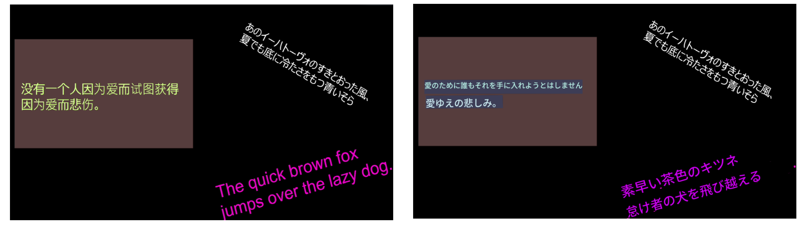
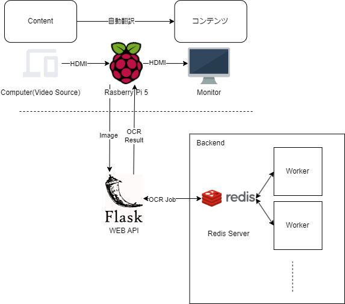
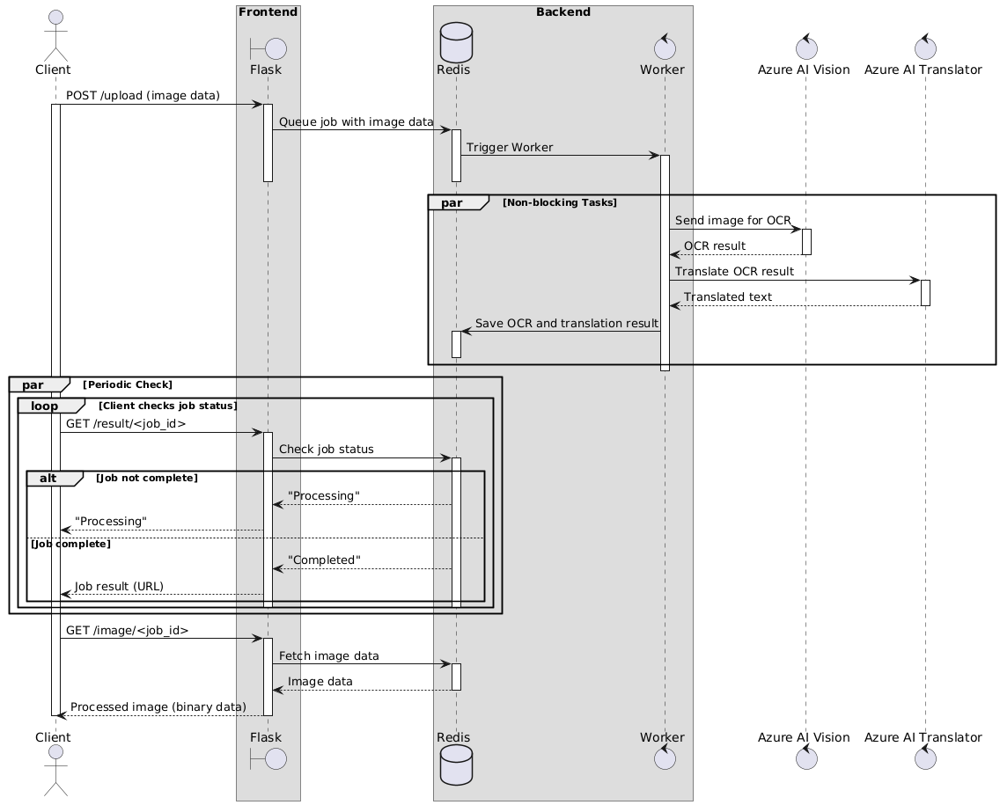

# Real-time translation system in video stream
映像入力されたものを翻訳し、リアルタイムで出力するシステムです。
リアルタイム性を確保するために、キャッシュした翻訳結果を利用します。

## 機能
- HDMIを通したビデオストリームをリアルタイムで読み取り、翻訳する
- 翻訳結果を合成しHDMIで出力する
- 翻訳結果のキャッシュ
- Celely、Redisを使用した分散処理
- APIキーを利用した認証
- 簡易的なテキスト色、背景色の取得と再現

## client
* 動作環境：WindowsまたはLinux(Raspberry Pi)

Raspberry Piを使用した場合は、GPIOを利用したスイッチを用意することで、機能の切り替えが可能です。

### setup
[client/readme.md](client/readme.md)

## frontend
* 動作環境：WindowsまたはLinux(Rasberry Piも可能)

Flaskを利用したAPIサーバーです。Redisを通してバックエンドと通信を行い、ジョブの管理と画像処理を行います。

### setup
[frontend/readme.md](frontend/readme.md)

## backend
* 動作環境：WindowsまたはLinux

RedisとCeleryを利用しOCRと翻訳、翻訳したテキストの合成を行います。
現在はAzure AIを利用しています。

### setup
[backend/readme.md](backend/readme.md)

## architecture

